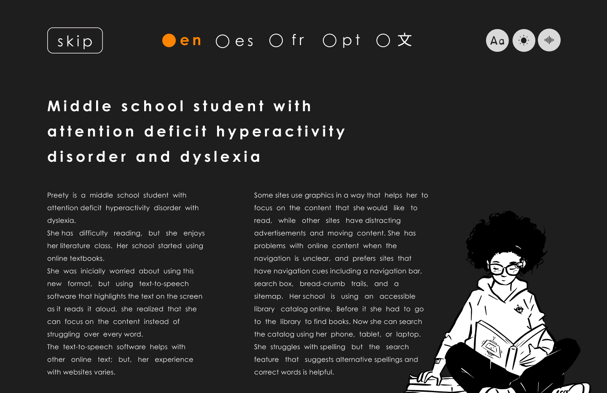

# Accessibility Cards by Vivian Motti & Ester Dura: Redesigned

“I build awareness about the importance of accessibility by creating a proposal for an accessible persona card and sharing my creation with others”

🔗 [Visit the website](https://alexandracordeiro.github.io/web-accessibility/)

# Screenshot 

    

# 📝 Context

While a person/user with no significant sensory, physical, or cognitive limitations will be able to use the accessibility cards just fine, a different-abled person (e.g., colour-blind autistic or dyslexic bilingual person) will not.

# 🎯 Goal

Choose one card from the Accessibility Cards set and redesign it in such a way that it accommodates for the needs of a different-abled person/user. The redesign can take a physical or digital format.

1) Identify the persona card you chose to redesign
    - Middle school student with ADHD and dyslexia
2) Describe the specific abilities of the person/use
    - no motor disability
    - ADHD and dyslexia
    - difficulty reading and concentrating
    - moving content can be too distracting
3) Specify how you made sure that your redesign accommodates for the needs of the person/user you defined
    - change font (OpenDyslexic/ CenturyGothic)
    - change contrast
    - available in 5 different languages (en, es, fr, pt, zh-CHS)
    - semantic HTML
    - scores 9.8/10 in [AccessMonitor](https://accessmonitor.acessibilidade.gov.pt/)
    - text-to-speech feature for each language

# 👇 References
- [Accessibility Persona Cards](https://journals.gmu.edu/index.php/ITLCP/article/view/2516/1559) by Vivian Motti & Ester Dura
- [AccessMonitor](https://accessmonitor.acessibilidade.gov.pt/) the web accessibility practices validator (WCAG 2.1)
- [OpenDyslexic Font](https://opendyslexic.org/) designed to mitigate dyslexia symptoms
- [CenturyGothic](https://en.wikipedia.org/wiki/Century_Gothic) is a dyslexia-friendly non-serif font
- [Uiverse](https://uiverse.io/gharsh11032000/moody-dog-23) for open source UI components
- [Bootstrap](https://icons.getbootstrap.com/) for open source icons
- [Figma](https://www.figma.com/) for prototyping